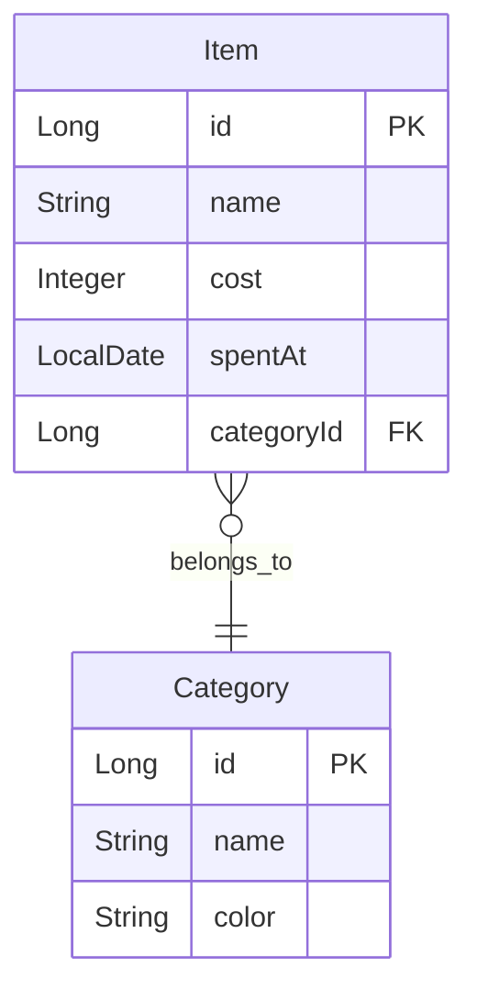

# Money Log

🇯🇵 [日本語](#日本語) | 🌏 [English](#english)

---

## 日本語

シンプルな家計簿アプリです。
日々の支出を記録し、カテゴリ別の支出をグラフで確認できます。

### Overview

Money Log は日々の支出を簡単に記録・管理できる Web アプリケーションです。

- 月ごとの支出一覧表示
- カテゴリ別の支出管理
- 支出のグラフ可視化

個人開発として、バックエンドからフロントエンドまで一貫して実装しました。

### Features

- 支出の追加 / 編集 / 削除（CRUD）
- 月ごとの支出一覧表示
- カテゴリ別管理
- 円グラフによる支出可視化
- モーダルフォーム入力
- タブ切り替え（一覧 / 集計）

### Screenshots

#### 支出一覧
月ごとの支出を一覧で表示します。


#### カテゴリ別支出グラフ
支出をカテゴリごとに集計し、円グラフで表示します。


### Tech Stack

**Backend**
- Java
- Spring Boot
- Spring MVC
- Thymeleaf
- JPA / Hibernate

**Frontend**
- JavaScript (ES Modules)
- Chart.js
- HTML / CSS

**Database**
- PostgreSQL

### Architecture

```
Controller
↓
Service
↓
Repository
↓
Database
```

フロントエンドは機能ごとに JavaScript モジュールを分割しています。

```
item.js
item-api.js
item-modal.js
item-validate.js
```

### Getting Started

```bash
git clone https://github.com/ksmshkt/money-log.git
cd money-log
./mvnw spring-boot:run
```

ブラウザで `http://localhost:8080` にアクセス

---

## English

A simple expense tracking web app.
Record your daily expenses and visualize spending by category.

### Overview

Money Log is a web application for easily recording and managing daily expenses.

- Monthly expense list view
- Category-based expense management
- Spending visualization with charts

Built as a personal project, covering everything from backend to frontend.

### Features

- Add / Edit / Delete expenses (CRUD)
- Monthly expense list view
- Category management
- Pie chart visualization by category
- Modal form input
- Tab switching (List / Summary)

### Screenshots

#### Expense List
Displays monthly expenses in a list view.


#### Category Spending Chart
Aggregates expenses by category and displays them as a pie chart.


### Tech Stack

**Backend**
- Java
- Spring Boot
- Spring MVC
- Thymeleaf
- JPA / Hibernate

**Frontend**
- JavaScript (ES Modules)
- Chart.js
- HTML / CSS

**Database**
- PostgreSQL

### Architecture

```
Controller
↓
Service
↓
Repository
↓
Database
```

Frontend JavaScript is split into modules by feature.

```
item.js
item-api.js
item-modal.js
item-validate.js
```

### Getting Started

```bash
git clone https://github.com/ksmshkt/money-log.git
cd money-log
./mvnw spring-boot:run
```

Open `http://localhost:8080` in your browser.

---

## Database ER Diagram



---

## Author

[@ksmshkt](https://github.com/ksmshkt)
